# Patient-Tracker-System
-------------------------------------
The Patient Tracker System is an intuitive, web-based digital solution designed to transform patient care within healthcare facilities. By providing a seamless platform for healthcare providers to efficiently track patient records, schedule appointments and manage treatment plans, the system aims to streamline healthcare processes and improve patient care.

This app is the project from CS520 class at UMass Amherst in Fall, 2023. The goal is to develop a patient tracker app that provides a patient login into the system, view doctors, book/modify/cancel appointment etc and a doctor can also login into the system, see all patients assigned under them, update patient prescription etc.

We are using Client-Server Design pattern. The architechture diagram for the app is :
    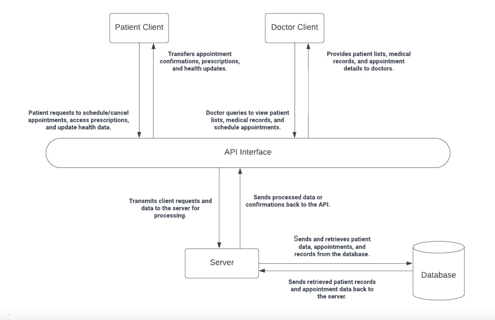


The functional requirement covered in this project are :

1. As a doctor, I want to view the list of patients scheduled for the day so that I can prepare for the consultations.
   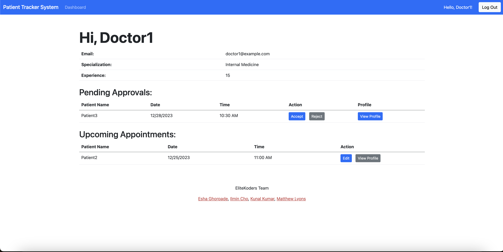

2. As a doctor, I want to view a patient's medical records before the consultation so that I can provide the best care possible.
   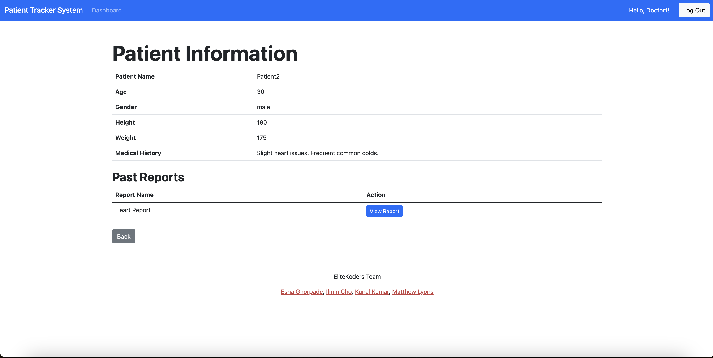

3. As a doctor, I want to upload prescriptions electronically on the server so that the patients can check it.
   

4. As a doctor, I want to create and modify treatment plans for my patients so that they have a structured approach to their recovery.
   

5. As a doctor, I want to set my available hours and days so that patients can book appointments when I'm available. 
   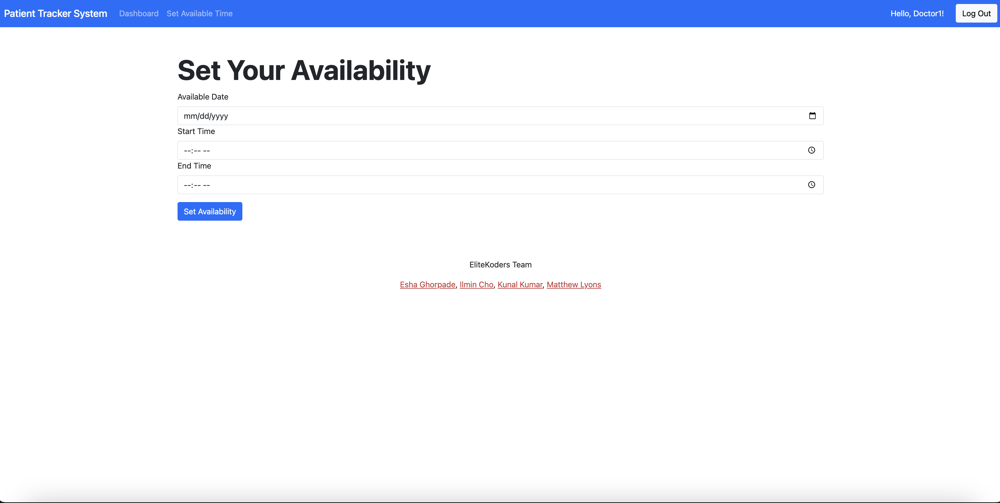

6. As a doctor, I accept appointments requested by patients and meet with them to conduct consultations.
   

7. As a patient, I want to book an appointment with my doctor so that I can discuss my health concerns.
   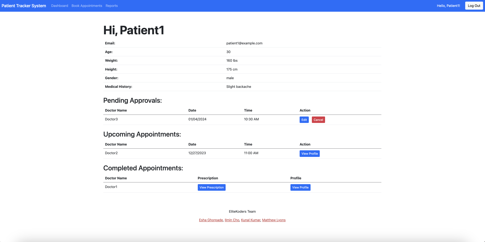
   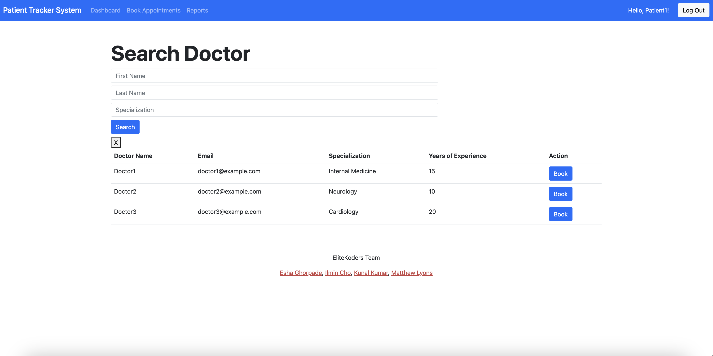
   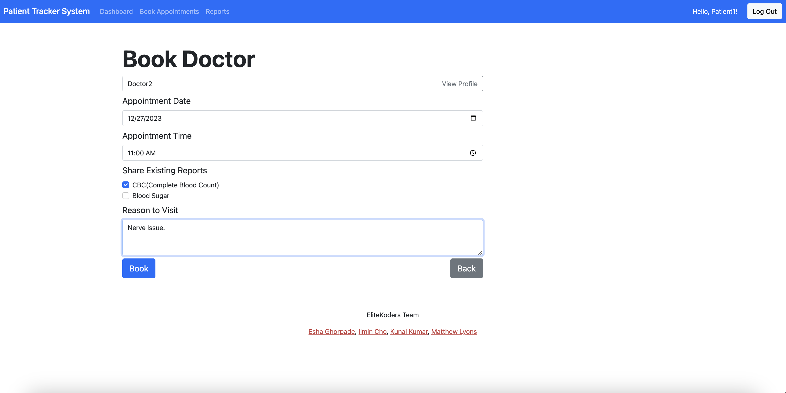
   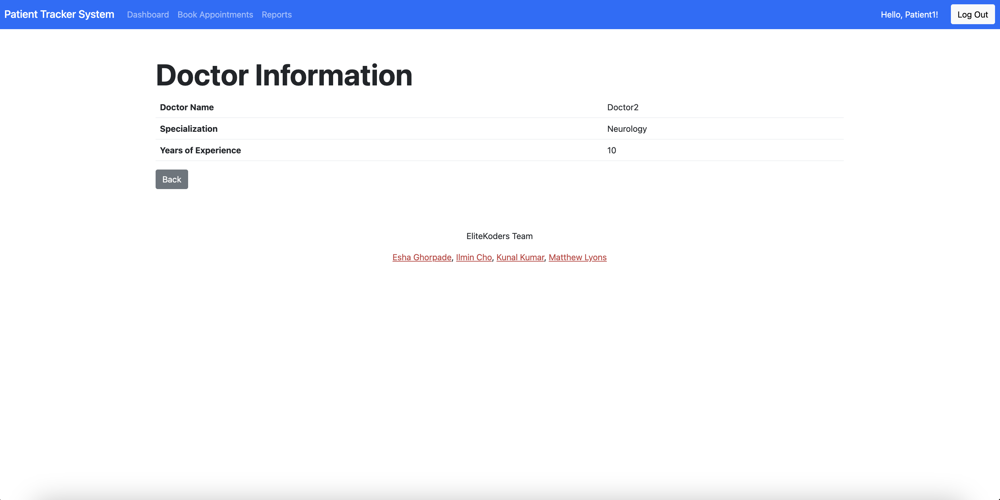

8. As a patient, I want to cancel my appointment if I am unable to attend so that the slot can be used by someone else.
   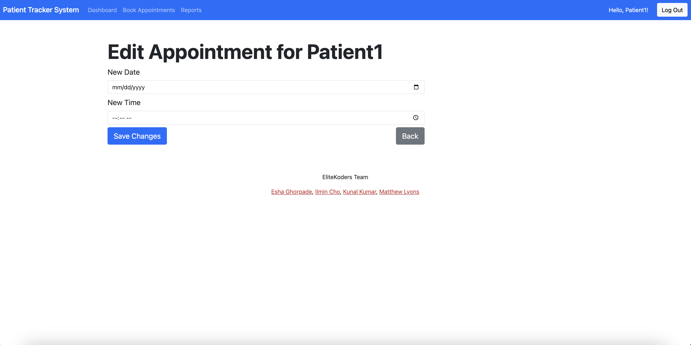

9. As a patient, I want to view and download my prescriptions so that I can acquire the necessary medications.
   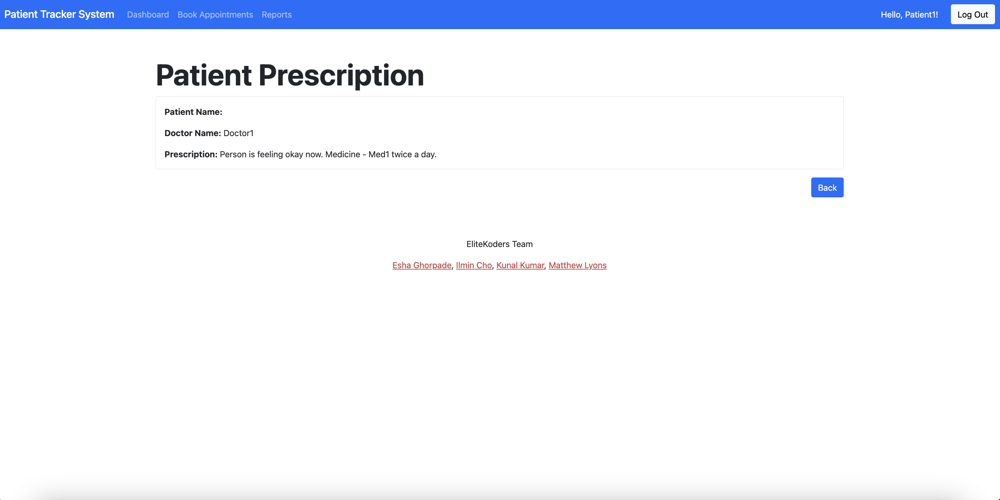

10. As a patient, I update my health status and information so that my doctor can check.
    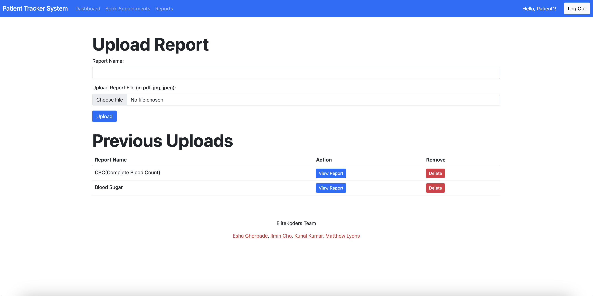
    
    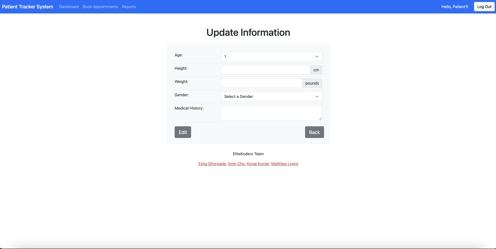

11. As a user, I want to sign up to the website as a doctor or patient.
    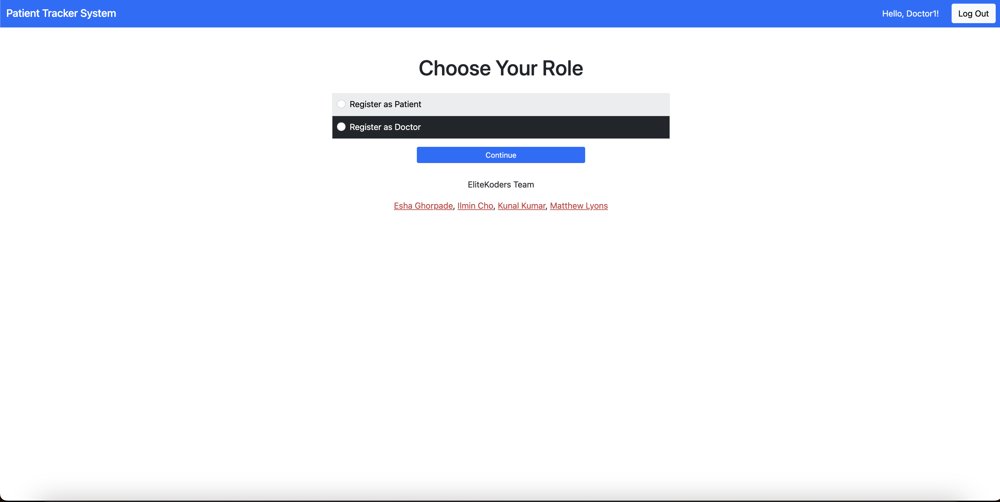
    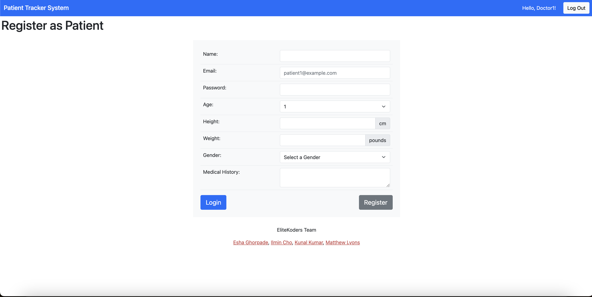
    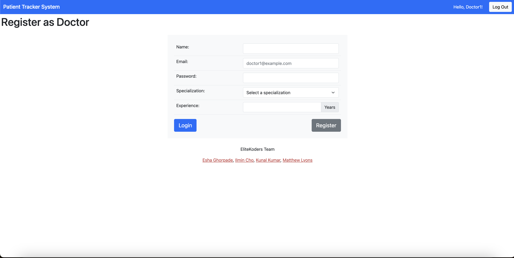

12. As a user, I want to log in to the website as a doctor or as a patient.
    


# Getting Started
---------------------------------------
## Installation
---------------------------------------
Create conda environment :
```conda create --name project520 python=3.9 -y```

Activate conda environment : 
```conda activate project520```

Install all the dependencies :
```pip install -r requirements.txt```

Start the web app :
```python server.py```

## Test Coverage
---------------------------------------
Run tests with coverage :
```coverage run -m pytest test_server.py```

Generate coverage report :
```coverage report -m```

Or View it in HTML format (preferred) :
```coverage html```

Test Coverage is present in :
```htmlcov/index.html```


# Technologies Used
---------------------------------------
* Python
* Flask
* RESTApi
* sqlite3
* HTML
* CSS
* Jinja
* Pytest


# Collaborators
---------------------------------------
<body>
<table>
  <tr>
    <td>
      <a href="https://github.com/eshag06">
        
      </a>
    </td>
    <td>
      <a href="https://github.com/IlMinCho">
        
      </a>
    </td>
  </tr>
  <tr>
    <td>
      <a href="https://github.com/kunalkumar168">
        
      </a>
    </td>
    <td>
      <a href="https://github.com/Msushi">
        
      </a>
    </td>
  </tr>
</table>
</body>

# Video Presentation
---------------------------------------
<a href="https://youtu.be/0jL7RjzliDg">
  
</a>

